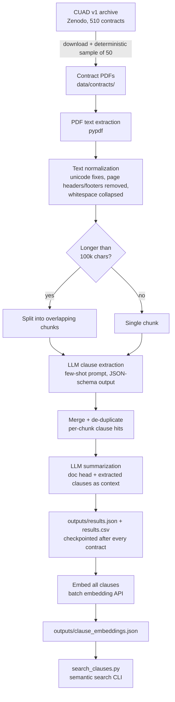

# Contract Clause Extraction & Summarization with LLMs (CUAD)

An end-to-end pipeline that analyzes legal contracts from the
[CUAD dataset](https://www.atticusprojectai.org/cuad) (Contract Understanding
Atticus Dataset) using a Large Language Model. For each contract it:

- **Part A — Clause extraction:** pulls the *termination*, *confidentiality*
  and *liability* clauses verbatim from the contract text.
- **Part B — Summarization:** generates a concise 100–150 word summary
  covering the purpose of the agreement, each party's key obligations, and
  notable risks or penalties.
- **Bonus:** builds a **semantic search index** over all extracted clauses
  (embeddings + cosine similarity) and uses **few-shot examples** in the
  extraction prompt.

## Flow diagram



## Setup

Requires Python 3.10+.

```bash
git clone <this-repo>
cd cuad-contract-analysis
pip install -r requirements.txt

cp .env.example .env
# edit .env and set GEMINI_API_KEY (free key: https://aistudio.google.com/apikey)
```

## Run

```bash
# Full run: downloads CUAD (~100 MB), processes 50 contracts,
# writes outputs/ and builds the semantic search index.
python run_pipeline.py

# Quick smoke test on 3 contracts
python run_pipeline.py -n 3

# Bonus: semantic search over the extracted clauses
python search_clauses.py "what happens if a party breaches the agreement"
python search_clauses.py "cap on damages" -k 3
```

The run is **resumable**: results are checkpointed to `outputs/results.json`
after every contract, so if you hit a rate limit or interrupt the run, just
re-run the same command and it continues where it stopped.

## Output format

`outputs/results.json` / `outputs/results.csv` with one row per contract:

| column | description |
|---|---|
| `contract_id` | CUAD source filename (without `.pdf`) |
| `summary` | 100–150 word summary (purpose, obligations, risks/penalties) |
| `termination_clause` | verbatim clause text, or `null` if absent |
| `confidentiality_clause` | verbatim clause text, or `null` if absent |
| `liability_clause` | verbatim clause text, or `null` if absent |
| `num_chars` | length of the normalized contract text |

## Approach

### 1. Data loading & preprocessing
- The official CUAD v1 archive is downloaded from Zenodo and **50 contracts
  are sampled deterministically** (fixed seed) from `full_contract_pdf/`, so
  the exact subset is reproducible.
- Text is extracted with `pypdf` and normalized: unicode quotes/dashes
  unified, control characters stripped, page-number lines and repeated
  provenance headers removed, whitespace collapsed.
- A small number of CUAD PDFs are image-only scans that yield almost no text;
  these are detected (`< 1500` extractable chars) and skipped in favour of the
  next sampled contract (the loader over-samples 2× for this reason).

### 2. LLM extraction & summarization
- **Model:** Google Gemini (`gemini-3.5-flash` by default) called through the
  plain REST API — dependency-light and easily swappable via `.env`. The free
  tier is sufficient for the whole assignment.
- **Structured output:** every call uses JSON mode with an explicit response
  schema, so the pipeline never parses free text.
- **Few-shot prompting (bonus):** the extraction prompt contains two worked
  examples — one positive and one where clause types are absent — which
  reduces paraphrasing and teaches the model to return `null` instead of
  inventing clauses.
- **Verbatim policy:** the prompt requires clauses to be quoted verbatim so
  every extraction is traceable to the source contract.
- **Handling large text:** contracts longer than ~100k characters are split
  into overlapping chunks; clause extraction runs per chunk and results are
  merged with overlap de-duplication. The summary uses the document head
  (parties/recitals/core obligations appear early) plus the already-extracted
  clauses, so risk language from deep in the document still informs it
  without re-sending the full text.
- **Rate limiting & retries:** client-side pacing keeps requests inside
  free-tier limits; 429/5xx responses are retried with exponential backoff.

### 3. Semantic search (bonus)
- Every extracted clause is embedded (`gemini-embedding-001`, 768-dim,
  batched) into `outputs/clause_embeddings.json`.
- `search_clauses.py` embeds a natural-language query and ranks clauses by
  cosine similarity — e.g. querying *"cap on damages"* surfaces liability
  clauses across all 50 contracts.

## Project structure

```
├── run_pipeline.py          # entry point
├── search_clauses.py        # bonus: semantic search CLI
├── requirements.txt
├── .env.example
└── src/
    ├── config.py            # paths, model names, tunables
    ├── data_loader.py       # CUAD download + deterministic sampling
    ├── preprocess.py        # PDF text extraction, normalization, chunking
    ├── llm_client.py        # REST client: JSON mode, retries, rate limiting
    ├── clause_extractor.py  # Part A (few-shot, chunked, merged)
    ├── summarizer.py        # Part B (100–150 word summary)
    ├── semantic_search.py   # bonus: embedding index + cosine search
    └── pipeline.py          # orchestration + checkpointing
```

## Design decisions & limitations

- **Two calls per contract** (extract, then summarize) rather than one: keeps
  each prompt focused, and feeding Part A's output into Part B grounds the
  summary's "risks and penalties" in actual clause text.
- **REST instead of an SDK:** fewer dependencies, and the request/response
  shapes are explicit in `llm_client.py`.
- Clause extraction quality is bounded by PDF text quality; heavily formatted
  tables or OCR-less scans are out of scope (scanned PDFs are skipped).
- CUAD's gold annotations could be used to compute extraction precision/recall
  against the labeled clause spans — a natural next step.
